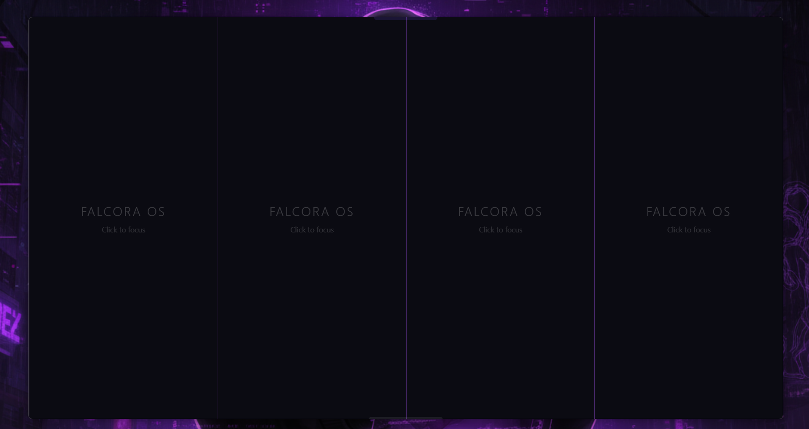

<div align="center">


# FalcoraOS Browser

**A Modern, AI-Integrated Browser for Power Users**

[](https://opensource.org/licenses/MIT)
[](https://electronjs.org/)
[](https://electronjs.org/)

</div>

---

## 📖 About

**FalcoraOS** is a next-generation browser environment designed to maximize productivity through intelligent multitasking. Built on Electron, it seamlessly integrates advanced split-screen capabilities with a context-aware AI assistant.

Whether you are a developer, researcher, or trader, FalcoraOS adapts to your workflow with specialized AI profiles and a keyboard-centric interface using modern Glassmorphism aesthetics.

## ✨ Key Features

### 🖥️ Advanced Split View
Multitask like a pro with the built-in vertical split view. Open two web pages side-by-side without needing multiple windows.
- **Vertical Split**: Instantly divide your screen.
- **Independent Navigation**: Control each view separately.

### 🤖 Context-Aware AI Sidebar (Coming Soon)
An integrated AI assistant that changes context based on your current activity.
- **Profiles**: Switch between `Work`, `Study`, `Shopping`, `Crypto`, `Research`, `Academic`, and `Personal` modes.
- **Vision Capable**: Analyze screen content directly.

### ⚡ Power User Shortcuts
Navigate the entire browser without lifting your hands from the keyboard.

### 🎨 Immersive UI
- **Glassmorphism Design**: Sleek, modern, and translucent interface.
- **Dynamic Backgrounds**: Subtle particle animations and fluid blobs.
- **Focus Mode**: distraction-free reading and browsing.

---

## 📸 Screenshots

| **Split View** | **Single View** |
|:---:|:---:|
|  |  |

---

## 🛠️ Installation & Development

### Prerequisites
- [Node.js](https://nodejs.org/) (v16 or higher)
- [Git](https://git-scm.com/)

### Getting Started

1.  **Clone the repository**
    ```bash
    git clone https://github.com/yourusername/falcoraos.git
    cd falcoraos
    ```

2.  **Install dependencies**
    ```bash
    npm install
    ```

3.  **Run locally**
    ```bash
    npm start
    ```

4.  **Build for production**
    ```bash
    # For Windows
    npm run build:win

    # For macOS
    npm run build:mac

    # For Linux
    npm run build:linux
    ```

---

## ⌨️ Keyboard Shortcuts

| Shortcut | Action |
| :--- | :--- |
| <kbd>Ctrl</kbd> + <kbd>T</kbd> | New Tab |
| <kbd>Ctrl</kbd> + <kbd>X</kbd> | Close Tab |
| <kbd>Ctrl</kbd> + <kbd>←</kbd> / <kbd>→</kbd> | Switch Tab |
| <kbd>Ctrl</kbd> + <kbd>\\</kbd> | Toggle Vertical Split |
| <kbd>Ctrl</kbd> + <kbd>W</kbd> | Close Split / Tab |
| <kbd>Ctrl</kbd> + <kbd>L</kbd> | Focus Address Bar |
| <kbd>Ctrl</kbd> + <kbd>B</kbd> | Toggle AI Sidebar |
| <kbd>F12</kbd> | Toggle Developer Tools |

---

## 🤝 Contributing

Contributions are welcome! Please feel free to submit a Pull Request.

## 📄 License

This project is licensed under the [MIT License](LICENSE).
